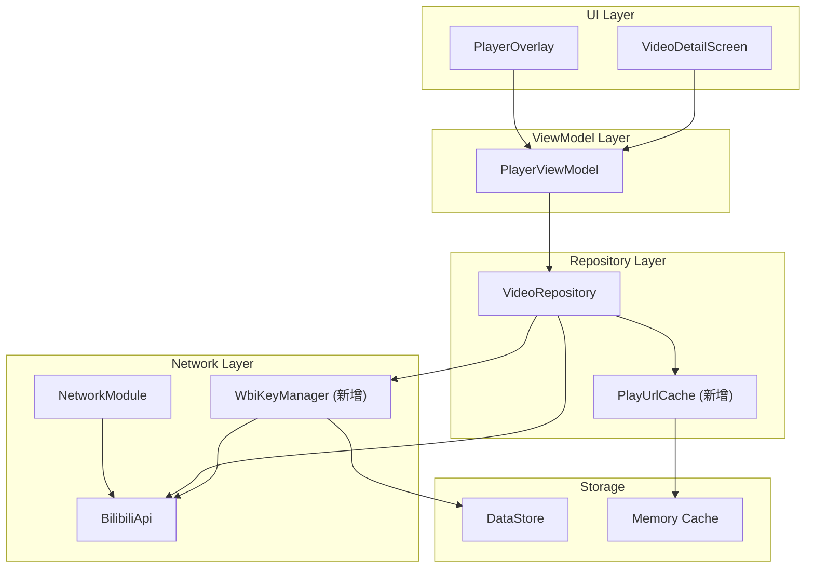
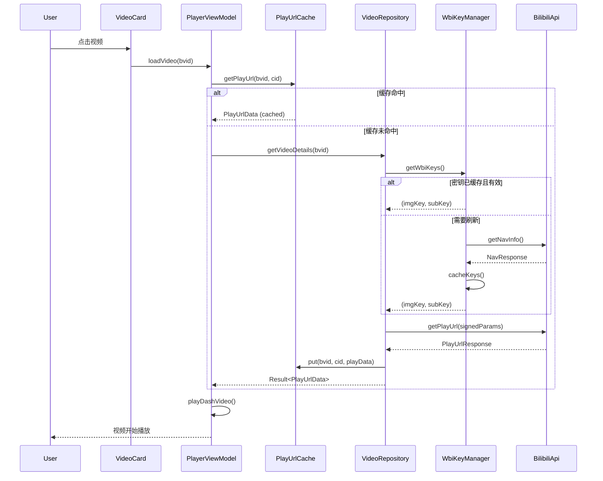
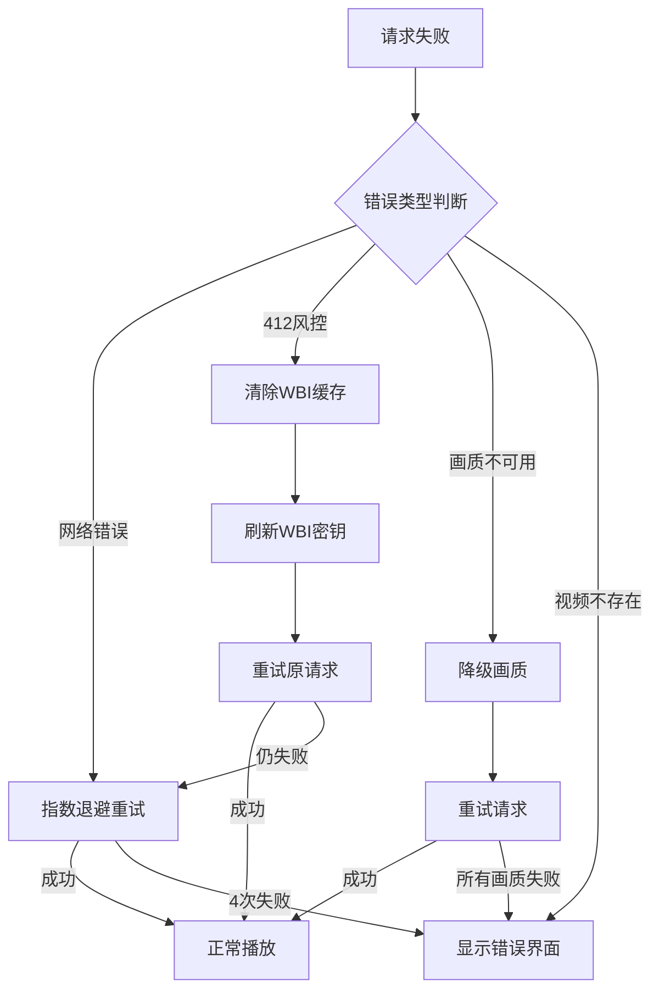

# 视频加载优化设计文档

## 概述

本设计文档描述了 BiliPai 应用视频加载优化功能的技术实现方案。主要目标是：

1. **提高可靠性**：确保视频播放 URL 获取成功率达到 99.9%
2. **加快加载速度**：减少用户点击到视频播放之间的等待时间
3. **增强错误处理**：提供清晰的错误反馈和自动恢复机制

---

## 架构

### 整体架构图



### 数据流图



---

## 组件和接口

### 1. PlayUrlCache（新增）

**职责**：缓存视频播放 URL，减少重复网络请求

**位置**：`core/cache/PlayUrlCache.kt`

```kotlin
object PlayUrlCache {
    private val cache = LruCache<String, CachedPlayUrl>(50)
    private const val CACHE_DURATION_MS = 10 * 60 * 1000L // 10分钟
    
    data class CachedPlayUrl(
        val data: PlayUrlData,
        val timestamp: Long
    )
    
    fun get(bvid: String, cid: Long): PlayUrlData?
    fun put(bvid: String, cid: Long, data: PlayUrlData)
    fun invalidate(bvid: String, cid: Long)
    fun clear()
    fun isValid(entry: CachedPlayUrl): Boolean
}
```

**设计决策**：

- 使用 LruCache 而非 HashMap，自动管理内存
- 缓存上限 50 条，避免内存消耗过大
- 缓存时间 10 分钟，平衡新鲜度和命中率

---

### 2. WbiKeyManager（重构）

**职责**：统一管理 WBI 签名密钥的获取、缓存和刷新

**位置**：`core/network/WbiKeyManager.kt`

```kotlin
object WbiKeyManager {
    private var cachedKeys: Pair<String, String>? = null
    private var cacheTimestamp: Long = 0
    private const val CACHE_DURATION_MS = 24 * 60 * 60 * 1000L // 24小时
    private val refreshMutex = Mutex()
    
    suspend fun getWbiKeys(): Result<Pair<String, String>>
    suspend fun refreshKeys(): Result<Pair<String, String>>
    fun invalidateCache()
    suspend fun persistToStorage(context: Context)
    suspend fun restoreFromStorage(context: Context)
}
```

**设计决策**：

- 使用 Mutex 防止并发刷新
- 增加持久化存储，应用重启后可恢复
- 缓存时间延长至 24 小时（B站密钥更新频率较低）

---

### 3. VideoRepository（修改）

**修改内容**：

```kotlin
object VideoRepository {
    // 新增：使用 PlayUrlCache
    suspend fun getVideoDetails(bvid: String): Result<Pair<ViewInfo, PlayUrlData>> {
        // 1. 先检查缓存
        val cachedData = PlayUrlCache.get(bvid, cid)
        if (cachedData != null) {
            return Result.success(Pair(info, cachedData))
        }
        
        // 2. 网络请求（带智能重试）
        val playData = fetchPlayUrlWithSmartRetry(bvid, cid, startQuality)
        
        // 3. 成功后缓存
        if (playData != null) {
            PlayUrlCache.put(bvid, cid, playData)
        }
        
        return Result.success(Pair(info, playData))
    }
    
    // 新增：智能重试逻辑
    private suspend fun fetchPlayUrlWithSmartRetry(
        bvid: String, 
        cid: Long, 
        targetQn: Int
    ): PlayUrlData?
}
```

---

### 4. RetryStrategy（新增）

**职责**：封装重试逻辑，支持指数退避和错误分类

**位置**：`core/util/RetryStrategy.kt`

```kotlin
object RetryStrategy {
    data class RetryConfig(
        val maxAttempts: Int = 4,
        val initialDelayMs: Long = 500,
        val maxDelayMs: Long = 5000,
        val multiplier: Double = 2.0
    )
    
    sealed class RetryResult<T> {
        data class Success<T>(val data: T) : RetryResult<T>()
        data class Failure<T>(val error: VideoLoadError) : RetryResult<T>()
    }
    
    suspend fun <T> executeWithRetry(
        config: RetryConfig = RetryConfig(),
        onAttempt: (attempt: Int) -> Unit = {},
        block: suspend () -> T?
    ): RetryResult<T>
}
```

---

### 5. VideoLoadError（新增）

**职责**：统一定义视频加载错误类型

**位置**：`data/model/VideoLoadError.kt`

```kotlin
sealed class VideoLoadError {
    object NetworkError : VideoLoadError()
    object WbiSignatureError : VideoLoadError()
    object VideoNotFound : VideoLoadError()
    object RegionRestricted : VideoLoadError()
    object VipRequired : VideoLoadError()
    object CidNotFound : VideoLoadError()
    data class ApiError(val code: Int, val message: String) : VideoLoadError()
    data class UnknownError(val throwable: Throwable) : VideoLoadError()
    
    fun toUserMessage(): String
    fun isRetryable(): Boolean
}
```

---

### 6. PlayerUiState（修改）

**修改内容**：增强 Loading 和 Error 状态

```kotlin
sealed interface PlayerUiState {
    object Initial : PlayerUiState
    
    // 新增：包含重试进度信息
    data class Loading(
        val retryAttempt: Int = 0,
        val maxAttempts: Int = 4,
        val message: String = "加载中..."
    ) : PlayerUiState
    
    data class Success(...) : PlayerUiState
    
    // 新增：包含错误类型和重试能力
    data class Error(
        val error: VideoLoadError,
        val canRetry: Boolean = true
    ) : PlayerUiState
}
```

---

## 数据模型

### 缓存数据结构

```kotlin
// PlayUrlCache 内部数据结构
data class CachedPlayUrl(
    val bvid: String,
    val cid: Long,
    val data: PlayUrlData,
    val quality: Int,
    val timestamp: Long,
    val expiresAt: Long
)

// WBI 密钥持久化结构
data class PersistedWbiKeys(
    val imgKey: String,
    val subKey: String,
    val timestamp: Long
)
```

### DataStore 键值

```kotlin
// 在 TokenManager 或新建 CacheManager 中
object CacheKeys {
    val WBI_IMG_KEY = stringPreferencesKey("wbi_img_key")
    val WBI_SUB_KEY = stringPreferencesKey("wbi_sub_key")
    val WBI_TIMESTAMP = longPreferencesKey("wbi_timestamp")
}
```

---

## 错误处理

### 错误分类与处理策略

| 错误类型 | HTTP Code | 处理策略 | 用户提示 |
|---------|-----------|----------|---------|
| 网络超时 | - | 自动重试 3 次 | "网络连接失败，请检查网络后重试" |
| WBI 签名失败 | 412 | 清除密钥缓存，重新获取后重试 | "验证失败，正在重试..." |
| 视频不存在 | 404 / -404 | 不重试，直接显示错误 | "视频不存在或已被删除" |
| 地区限制 | -10403 | 不重试，直接显示错误 | "该视频在当前地区不可用" |
| 需要大会员 | -10403 | 自动降级画质 | "已自动切换到可用画质" |
| CID 获取失败 | - | 重新请求视频详情 | "加载失败，请重试" |

### 错误恢复流程



---

## 测试策略

### 自动化测试

由于项目当前没有完整的单元测试基础设施，建议采用以下方式验证：

#### 1. 手动集成测试

**测试场景 1：正常视频加载**

1. 打开应用，确保已登录
2. 点击首页任意视频
3. 验证：视频应在 3 秒内开始播放
4. 返回首页，再次点击同一视频
5. 验证：视频应在 1 秒内开始播放（使用缓存）

**测试场景 2：网络异常恢复**

1. 开启飞行模式
2. 点击视频
3. 验证：显示"网络连接失败"错误界面
4. 关闭飞行模式
5. 点击重试按钮
6. 验证：视频成功加载

**测试场景 3：画质降级**

1. 使用非大会员账号
2. 点击一个 4K 视频
3. 验证：视频正常播放，Toast 提示"已自动切换到 XXX"

**测试场景 4：缓存有效性**

1. 打开一个视频，等待播放
2. 使用 Android Studio Logcat 查看 `VideoRepo` 日志
3. 返回并再次进入同一视频
4. 验证：Logcat 显示 "Cache hit for bvid=XXX"

#### 2. 日志验证

在开发过程中，添加详细日志以验证：

```kotlin
// 日志标签
private const val TAG = "VideoRepo"
private const val TAG_CACHE = "PlayUrlCache"
private const val TAG_WBI = "WbiKeyManager"

// 关键日志点
Log.d(TAG_CACHE, "✅ Cache hit: bvid=$bvid, cid=$cid")
Log.d(TAG_CACHE, "❌ Cache miss: bvid=$bvid, cid=$cid")
Log.d(TAG_WBI, "🔑 WBI keys refreshed successfully")
Log.d(TAG, "🔄 Retry attempt $attempt/$maxAttempts for bvid=$bvid")
```

### 验证检查清单

- [ ] 视频首次加载成功率 > 99%
- [ ] 缓存命中时加载时间 < 1s
- [ ] 网络错误时显示正确的错误信息
- [ ] 重试按钮功能正常
- [ ] 大会员视频正确降级
- [ ] WBI 密钥正确缓存和刷新
- [ ] 应用重启后 WBI 密钥恢复

---

## 设计决策与理由

### 1. 为什么使用 LruCache 而不是 HashMap？

**决策**：使用 `LruCache<String, CachedPlayUrl>(50)` 存储播放 URL

**理由**：

- 自动淘汰最少使用的条目，防止内存溢出
- 线程安全，适合多协程环境
- Android 原生支持，无需额外依赖

### 2. 为什么缓存时间设置为 10 分钟？

**决策**：播放 URL 缓存有效期为 10 分钟

**理由**：

- B 站 CDN URL 通常有效期为 2-4 小时
- 10 分钟足够覆盖用户短暂离开再返回的场景
- 避免使用过期 URL 导致播放失败

### 3. 为什么 WBI 密钥缓存 24 小时？

**决策**：WBI 密钥缓存延长至 24 小时

**理由**：

- B 站 WBI 密钥更新频率约为每日一次
- 减少 `/nav` 接口的请求频率，降低被风控的风险
- 即使密钥过期，有自动刷新机制保底

### 4. 为什么重试采用指数退避？

**决策**：重试间隔为 500ms → 1s → 2s → 4s

**理由**：

- 避免频繁请求触发服务器限流
- 给临时性网络问题足够的恢复时间
- 总等待时间约 7.5 秒，用户体验可接受

---

## 影响范围

### 需要修改的文件

1. **新增文件**
   - `core/cache/PlayUrlCache.kt`
   - `core/network/WbiKeyManager.kt`
   - `core/util/RetryStrategy.kt`
   - `data/model/VideoLoadError.kt`

2. **修改文件**
   - `data/repository/VideoRepository.kt` - 集成缓存和新重试逻辑
   - `feature/video/PlayerViewModel.kt` - 更新 UI 状态处理
   - `feature/video/PlayerUiState.kt` - 增强状态类型

### 向后兼容性

- ✅ 所有修改都是内部实现变更
- ✅ 不影响现有 API 接口
- ✅ 不影响现有数据模型
- ✅ 用户无感知的优化

---

## 风险与缓解

| 风险 | 影响 | 缓解措施 |
|-----|------|---------|
| 缓存数据过期导致播放失败 | 高 | 播放失败时自动清除缓存并重试 |
| WBI 密钥持久化失败 | 中 | 失败时回退到每次请求刷新 |
| 内存缓存被系统回收 | 低 | 缓存未命中时正常走网络请求 |
| 并发请求导致重复刷新 | 低 | 使用 Mutex 确保单次刷新 |
